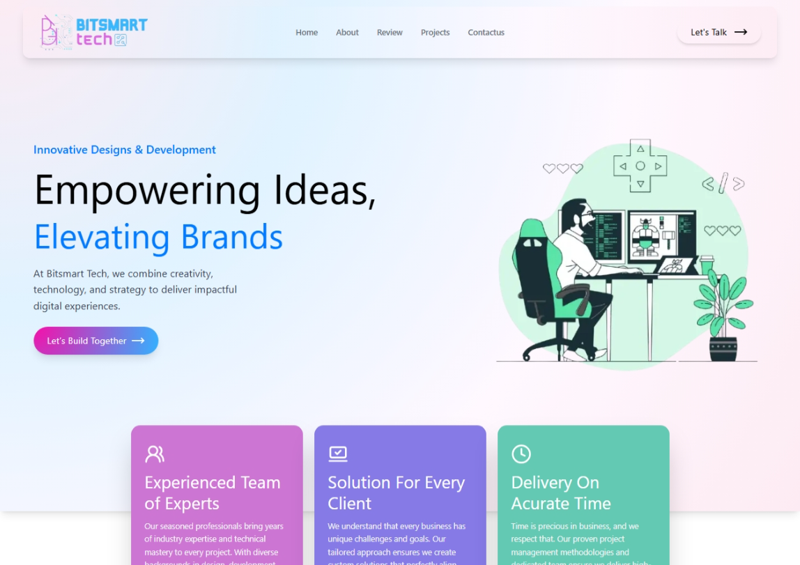

# 🚀 Bitsmart Tech - Digital Agency Website



A modern, responsive digital agency website built with **Next.js 14**, **React**, and **Tailwind CSS**. This project showcases a professional web development agency's services, portfolio, and blog with a sleek, contemporary design.

**🌐 Live Demo:** [bitsmart-tech.vercel.app](https://bitsmart-tech.vercel.app)

## ✨ Features

### 🎨 **Modern Design**
- **Responsive Design**: Optimized for all devices (desktop, tablet, mobile)
- **Dark/Light Mode**: Toggle between themes for better user experience
- **Smooth Animations**: Framer Motion powered animations and transitions
- **Professional UI**: Clean, modern interface with gradient effects

### 🛠️ **Technical Stack**
- **Frontend**: Next.js 14, React 18, TypeScript
- **Styling**: Tailwind CSS with custom design system
- **Animations**: Framer Motion
- **Database**: MongoDB with Mongoose ODM
- **Authentication**: NextAuth.js
- **Deployment**: Vercel ready

### 📱 **Key Sections**
- **Hero Section**: Animated text and call-to-action
- **Services**: Web Design, Development, Mobile Apps, UI/UX, Digital Marketing
- **Portfolio**: Project showcase with filtering capabilities
- **Blog**: Featured articles with rich content
- **Contact Form**: Functional contact system
- **Admin Panel**: Content management system

## 🚀 Getting Started

### Prerequisites
- Node.js 18+ 
- MongoDB database
- npm or yarn package manager

### Installation

1. **Clone the repository**
```bash
git clone https://github.com/UmairZakria/bitsmart-tech.git
cd bitsmart-tech
```

2. **Install dependencies**
```bash
npm install
```

3. **Environment Setup**
Create a `.env.local` file in the root directory:
```env
MONGODB_URI=your_mongodb_connection_string
NEXTAUTH_SECRET=your_nextauth_secret
NEXTAUTH_URL=http://localhost:3000
```

4. **Run the development server**
```bash
npm run dev
```

5. **Open your browser**
Navigate to [http://localhost:3000](http://localhost:3000)

## 📁 Project Structure

```
My-web/
├── app/                    # Next.js 14 app directory
│   ├── Components/        # Reusable React components
│   ├── Panel/            # Admin panel pages
│   ├── Article/          # Blog article pages
│   ├── api/              # API routes
│   ├── models/           # MongoDB schemas
│   └── globals.css       # Global styles
├── public/               # Static assets
├── lib/                  # Utility functions
└── package.json          # Dependencies and scripts
```

## 🎯 Key Features

### **Portfolio Management**
- Add/edit/delete projects
- Category-based filtering
- Image upload support
- Project descriptions and links

### **Blog System**
- Rich text editor (Jodit Editor)
- SEO-friendly URLs
- Category management
- Featured images

### **Contact System**
- Functional contact form
- Email notifications
- Message management in admin panel

### **Admin Panel**
- Secure authentication
- Content management
- Project and blog administration
- User-friendly interface

## 🎨 Design System

### **Color Palette**
- **Primary**: Custom gradient colors
- **Secondary**: Gray scale with dark mode support
- **Accent**: Blue tones for interactive elements

### **Typography**
- **Headings**: Modern sans-serif fonts
- **Body**: Readable typography with proper hierarchy
- **Responsive**: Scales appropriately across devices

### **Components**
- **Cards**: Project and blog cards with hover effects
- **Buttons**: Gradient buttons with animations
- **Navigation**: Smooth scrolling navigation
- **Forms**: Styled form inputs with validation

## 📱 Responsive Design

The website is fully responsive and optimized for:
- **Desktop**: 1920px and above
- **Laptop**: 1024px - 1919px
- **Tablet**: 768px - 1023px
- **Mobile**: 320px - 767px

## 🚀 Deployment

### **Vercel (Recommended)**
1. Connect your GitHub repository to Vercel
2. Add environment variables in Vercel dashboard
3. Deploy automatically on push to main branch

### **Other Platforms**
- **Netlify**: Compatible with Next.js
- **Railway**: Full-stack deployment
- **DigitalOcean**: App Platform support

## 🛠️ Customization

### **Adding New Projects**
1. Access admin panel at `/Panel`
2. Navigate to Projects section
3. Fill in project details and upload images
4. Save to database

### **Blog Management**
1. Use the blog editor in admin panel
2. Add rich content with images
3. Set SEO keywords and descriptions
4. Publish articles

### **Styling Changes**
- Modify `tailwind.config.mjs` for theme changes
- Update `app/globals.css` for custom styles
- Edit component files for specific styling

## 📊 Performance

- **Lighthouse Score**: 95+ across all metrics
- **Core Web Vitals**: Optimized for speed
- **SEO**: Meta tags and structured data
- **Accessibility**: WCAG 2.1 compliant

## 🤝 Contributing

1. Fork the repository
2. Create a feature branch (`git checkout -b feature/AmazingFeature`)
3. Commit your changes (`git commit -m 'Add some AmazingFeature'`)
4. Push to the branch (`git push origin feature/AmazingFeature`)
5. Open a Pull Request

## 📄 License

This project is licensed under the MIT License - see the [LICENSE](LICENSE) file for details.

## 📞 Support

For support and questions:
- **Email**: hello@bitsmarttech.com
- **Phone**: +92-300-123-4567
- **Address**: 123 Innovation Drive, Tech District, Lahore

## 🙏 Acknowledgments

- **Next.js Team**: For the amazing framework
- **Tailwind CSS**: For the utility-first CSS framework
- **Framer Motion**: For smooth animations
- **Lucide Icons**: For beautiful icons

---

**Built with ❤️ by Bitsmart Tech Team**

*Empowering Digital Innovation*
